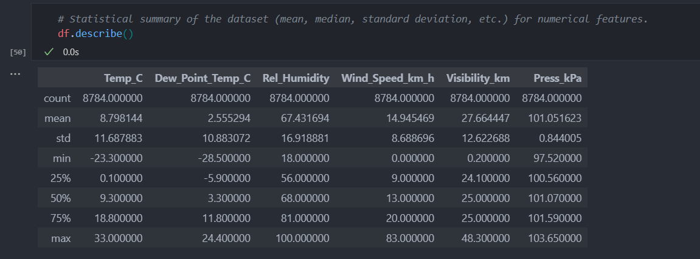

# Exploratory Data Analysis for Weather_Data

## Introduction
This project explores the weather_data, in a bid to understand and clean the data where needed. Exploratory data analysis of the weather data also allows us to visualize trends and identify relationships between features.

To run the analysis in the Jupyter Notebook effectively, please ensure the dataset (CSV file) is located in the same directory as the Notebook.

## The Analysis.
By exploring the weather data, I called the ".info()" function which revealed that our dataset contains 8784 records, 8 features, and no null values, The dataset also contains 4 features with 'float' datatype, 2 with 'int', and 2 with 'object' data type. To handle null values, I called the '.isnull().sum()' function, as this returns the sum of all the null values in every feature. The result confirmed our dataset has no null value. In addition, the dataset was found to have no duplicate records.

The statistical summary of numerical features in the dataset revealed the mean, median, standard deviation etc. as shown below. The high variation in mean, median, or S.D, among features may pose a scaling issue. Hence the data may require scaling for more accurate analysis.

The exploration of our dataset also revealed some outliers, especially within the 'wind speed' and 'visibility' features. This was analysed using a boxplot on seaborn. The outliers observed may be due to extreme cases of these weather conditions or may just be errors in measurements.

In addition, visualisation of the dataset, using a time-series graph revealed that relative humidity, wind speed, visibility and pressure were fairly stable all through the year. However, temperature and dew point temperature were both highest midway into the year. This also suggests that relative humidity, wind speed, visibility and pressure were fairly stable across all seasons in the year, while temperature and dew point temperature appeared to be highest during summer.

Correlation matrices and heatmaps using seaborn revealed multicollinearity between 'temperature' and 'dew point temperature'. There was a high correlation between Temperature and Dew point temperature, and following the principle of multicollinearity, one of these independent variables will have to be dropped to prevent redundancy.

Furthermore, our EDA shows that features in this dataset exhibit a normal distribution. However, the distribution graph for 'visibility_km' was observed to be very small. This anomaly could be due to scaling problem as all the features tend to have different measurements scales. 

## Recommendation for Further Analysis
* Conducting feature scaling of the data to ensure all feature measurements are on the same scale.
* Logistic Regression Analysis for predictive modelling. This might first require encoding of categogerical variable like "Weather"